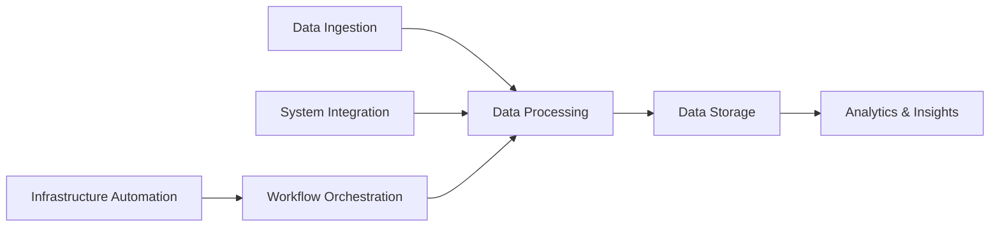
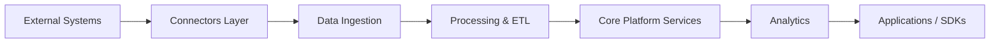
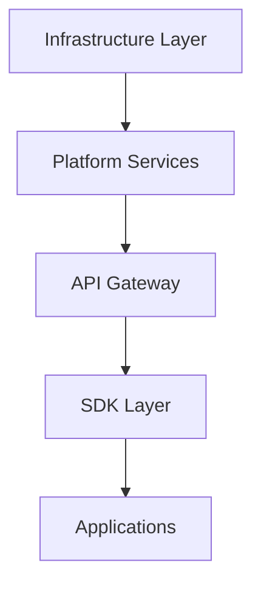
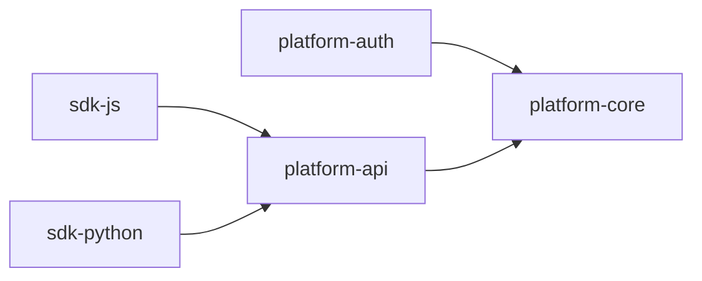
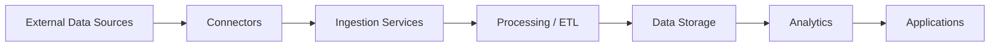
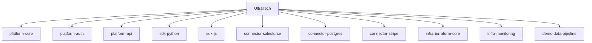

# UltraTech, Inc.

<p align="center">
  <a href="https://ultratech.co.mz">
    
  </a>
  <a href="https://linkedin.com/company/ultratech">
    
  </a>
  <a href="mailto:opensource@ultratech.co.mz">
    
  </a>
  <a href="https://github.com/UltraTech">
    
  </a>
</p>

<p align="center">
  
  
  
  
</p>

---

## What We Do

UltraTech builds enterprise technology platforms that integrate systems, orchestrate infrastructure, and transform operational data into actionable insights. Our ecosystem enables organizations to automate workflows, connect distributed services, and scale data-driven decision making.

---

## Mission

Enable organizations to make faster and smarter decisions through reliable, scalable, and integrated technology platforms.

---

# Platform Capability Map



This map highlights the functional capabilities of the UltraTech platform.

---

# Platform Architecture



---

# Architecture Layers



---

# Dependency Architecture Map



---

# Platform Data Flow



---

# Core Platform Components

| Component           | Description                                  |
| ------------------- | -------------------------------------------- |
| platform-core       | Platform orchestration and internal services |
| platform-auth       | Identity and authentication services         |
| platform-api        | Unified API gateway                          |
| platform-ingestion  | Data ingestion services                      |
| platform-processing | Data processing pipelines                    |
| platform-analytics  | Data analysis and insight generation         |

---

# Organization Repository Map



---

# Service Topology

| Repository           | Language   | Status  | Build                                                            | Documentation    |
| -------------------- | ---------- | ------- | ---------------------------------------------------------------- | ---------------- |
| platform-core        | Go         | Active  |  | /docs/core       |
| platform-auth        | Go         | Active  |  | /docs/auth       |
| platform-api         | Node.js    | Active  |  | /docs/api        |
| sdk-python           | Python     | Stable  |  | /docs/sdk-python |
| sdk-js               | TypeScript | Stable  |  | /docs/sdk-js     |
| connector-salesforce | Python     | Beta    |  | /docs/connectors |
| connector-postgres   | Go         | Stable  |  | /docs/connectors |
| connector-stripe     | Node.js    | Beta    |  | /docs/connectors |
| infra-terraform-core | Terraform  | Stable  |  | /docs/infra      |
| infra-monitoring     | Terraform  | Stable  |  | /docs/infra      |
| demo-data-pipeline   | Python     | Example |  | /docs/demo       |

---

# Developer Architecture Guide

Repository structure conventions:

```
platform-*     → core services
connector-*    → external integrations
sdk-*          → client SDKs
infra-*        → infrastructure and deployment
demo-*         → examples and tutorials
```

Examples:

```
platform-streaming
connector-mysql
sdk-go
infra-kubernetes
```

---

# 5‑Minute Developer Onboarding

Clone the repository:

```
git clone https://github.com/UltraTech/platform-core
```

Run development environment:

```
docker compose up
```

Install dependencies:

```
npm install
```

Run platform locally:

```
npm run dev
```

---

# Engineering Dashboard

| Metric        | Badge                                                                |
| ------------- | -------------------------------------------------------------------- |
| CI/CD         |         |
| Code Coverage |  |
| Security      |     |
| OpenSSF       |    |

---

# Public Platform Roadmap

| Phase   | Focus                  |
| ------- | ---------------------- |
| Phase 1 | Core platform services |
| Phase 2 | Connectors ecosystem   |
| Phase 3 | SDK expansion          |
| Phase 4 | AI-powered analytics   |

---

# Contributing

1. Fork the repository
2. Create a feature branch

```
git checkout -b feature/my-feature
```

3. Commit changes

```
git commit -m "feat: add new connector"
```

4. Push and open Pull Request

All contributions must pass CI, tests, and code linting.

---

# License

Projects are released under MIT or Apache 2.0 license depending on repository.

---

# Contact

| Channel  | Link                                                                             |
| -------- | -------------------------------------------------------------------------------- |
| Website  | [https://ultratech.co.mz](https://ultratech.co.mz)                               |
| Email    | [opensource@ultratech.co.mz](mailto:opensource@ultratech.co.mz)                  |
| LinkedIn | [https://linkedin.com/company/ultratech](https://linkedin.com/company/ultratech) |
| GitHub   | [https://github.com/UltraTech](https://github.com/UltraTech-Inc)                     |

---

<p align="center">
Built with engineering discipline, open collaboration, and scalable architecture.
</p>
